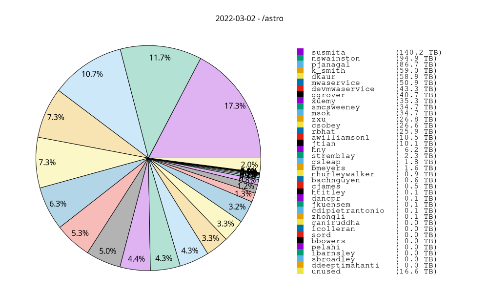

# garrawarla-piecharts
Making piecharts from Pawsey usage reports

## Requires

* Gnuplot
* Awk

## Usage

From the Robin Hood reports that are emailed out, cut and paste the part relevant to your group into a
file called `YYYYMMDD-astro.txt`, where YYYYMMDD represents the date. For example:

**20220302-astro.txt**:
```
=== mwavcs ===
Lustre Quota:
Disk quotas for grp mwavcs (gid 34858):
     Filesystem    used   quota   limit   grace   files   quota   limit   grace
         /astro    801T      0k    810T       - 27098481       0       0       -

     group,       user,     type,      count,     volume,   spc_used,   avg_size
    mwavcs, awilliamson1,     file,     950530,   10.47 TB,   10.47 TB,   11.55 MB
    mwavcs, bachnguyen,     file,       2789,  662.22 GB,  660.17 GB,  243.14 MB
    mwavcs,    bbowers,     file,        406,    1.63 GB,    1.61 GB,    4.10 MB
    mwavcs,    bmeyers,     file,      71513,    1.57 TB,    1.58 TB,   23.09 MB
    mwavcs, cdipietrantonio,     file,      38605,   60.62 GB,   56.51 GB,    1.61 MB
    mwavcs,     cjames,     file,        381,  543.54 GB,  457.58 GB,    1.43 GB
    mwavcs,     csobey,     file,      92215,   26.58 TB,   26.58 TB,  302.21 MB
    mwavcs,     dancpr,     file,       2684,   96.49 GB,   96.06 GB,   36.81 MB
    mwavcs, ddeeptimahanti,     file,          1,    1.22 KB,    4.00 KB,    1.22 KB
    mwavcs, devmwaservice,     file,       9103,   43.26 TB,   43.26 TB,    4.87 GB
    mwavcs,      dkaur,     file,     186768,   58.86 TB,   58.75 TB,  330.47 MB
    mwavcs, ganiruddha,     file,      10690,   37.49 GB,   36.89 GB,    3.59 MB
    mwavcs,    ggrover,     file,     120999,   40.73 TB,   40.34 TB,  352.98 MB
    mwavcs,     gsleap,     file,        377,    1.80 TB,    1.80 TB,    4.89 GB
    mwavcs,        hny,     file,       1308,    6.18 TB,    6.18 TB,    4.84 GB
    mwavcs,    htitley,     file,       2780,  120.59 GB,  120.60 GB,   44.42 MB
    mwavcs,  ibarnsley,     file,         10,  508.58 MB,  508.61 MB,   50.86 MB
    mwavcs,  icolleran,     file,       3458,   25.96 GB,   25.91 GB,    7.69 MB
    mwavcs,   jkuensem,     file,         75,   65.36 GB,   65.36 GB,  892.34 MB
    mwavcs,      jtian,     file,    3710100,   10.05 TB,    9.78 TB,    2.84 MB
    mwavcs,    k_smith,     file,     220975,   59.03 TB,   58.89 TB,  280.10 MB
    mwavcs,       msok,     file,     845734,   34.68 TB,   32.66 TB,   43.00 MB
    mwavcs, mwaservice,     file,     157994,   50.87 TB,   50.86 TB,  337.58 MB
    mwavcs, nhurleywalker,     file,         24,  909.80 GB,  909.60 GB,   37.91 GB
    mwavcs, nswainston,     file,     606644,   94.92 TB,   95.83 TB,  164.08 MB
    mwavcs,     pelahi,     file,        197,    1.41 GB,    1.37 GB,    7.34 MB
    mwavcs,   pjanagal,     file,     592420,   86.72 TB,   86.26 TB,  153.50 MB
    mwavcs,      rbhat,     file,     100931,   25.90 TB,   25.86 TB,  269.03 MB
    mwavcs,  sbroadley,     file,        109,   83.84 MB,   66.28 MB,  787.61 KB
    mwavcs, smcsweeney,     file,     523061,   34.72 TB,   34.31 TB,   69.59 MB
    mwavcs,       sord,     file,         64,   10.58 GB,   10.58 GB,  169.29 MB
    mwavcs,  stremblay,     file,     157469,    2.27 TB,    2.27 TB,   15.13 MB
    mwavcs,    susmita,     file,   17983648,  140.20 TB,  137.26 TB,    8.17 MB
    mwavcs,      xuemy,     file,     325209,   35.31 TB,   35.11 TB,  113.84 MB
    mwavcs,    zhongli,     file,       4621,   52.19 GB,   65.71 GB,   11.56 MB
    mwavcs,        zxu,     file,     103421,   26.79 TB,   26.35 TB,  271.66 MB
```

Then, run
```
make YYYYMMDD-astro.png
```
which should produce an image like the following example:

